# **Elementos UX y UI**

**Objetivo de Negocio**

El objetivo de esta página es el poder generar un cambio en la vida de las posibles alumnas con este programa que ofrece, así como que también ofrece a los negocios talent tech para sus empresas.

En este proyecto veremos los elementos tanto de Ux como de Ui de la página de [**Laboratoria**](http://www.laboratoria.la/ ).

## ** Comencemos:**

Esta es nuestra pantalla de bienvenida

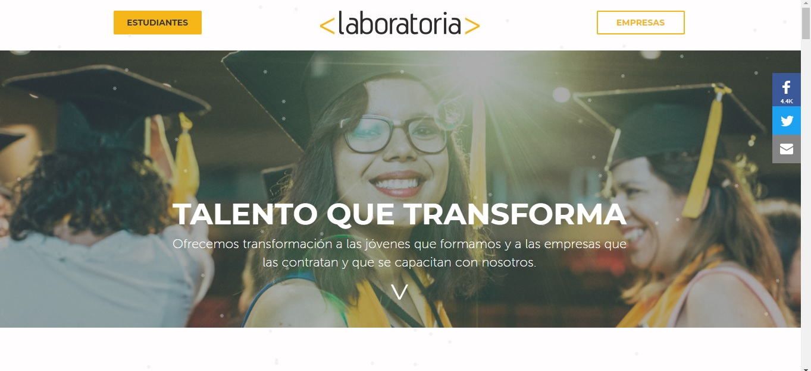

**Elementos UI**
En estapantalla podemos observar :
* Dos botones que dicen estudiantes y empresas
* Una barra laterl al lado del banner donde se encuentran las redes sociales de Laboratoria

**Elementos UX**
Mientras que en él lado de UX podemos encontrar que hay un banner con tres estudiantes graduadas de Laboratoria, con sonrisas en el rostro.

Así como tambien la leyenda que dice: "**TALENTO QUE TRANSFORMA**
Ofrecemos transformación a las jóvenes que formamos y a las empresas que las contratan y que se capacitan con nosotros."

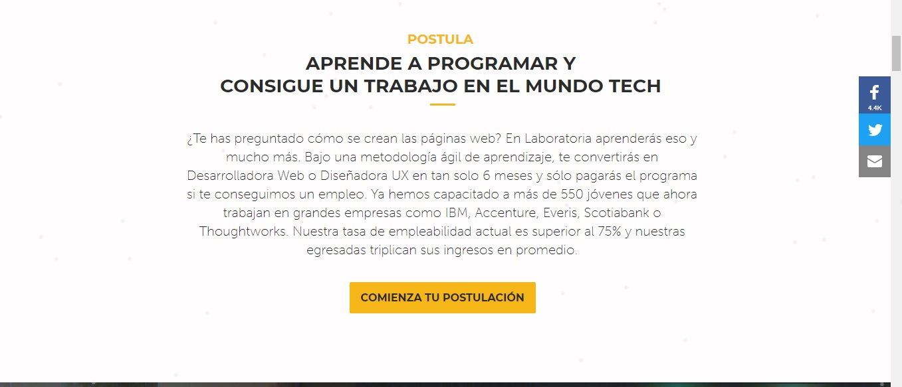

Esta imagen se encuetra al hacer scroll en la pantalla de bienvenida.

**Elementos UI**
* Podemos seguir observando los botones de las redes sociales dela empresa
* Además de un botón con la leyenda **"Comienza tu Postulación"**

**Elementos UX**

Aquí ya comienzan a dar un poco de infomación de lo que es la empresa y de como puedes llegar a convertirte en Desarrolladora Web o Diseñadora UX en 6 meses y de como ese talento de Laboratoria está en empresas muy importantes.

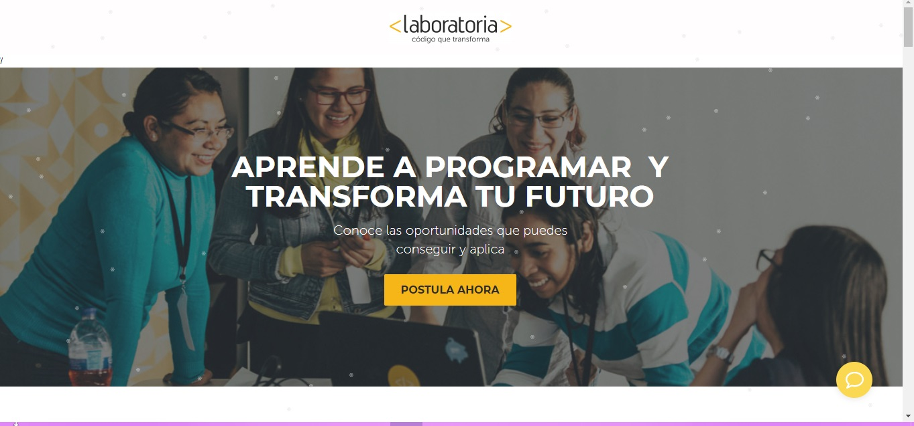

Al dar clic en postulantes o en comienza tu postulación se abre esta nueva ventana.

**Elementos UI**
* Podemos ver un botón que dice:**"Postula Ahora"**
* También podemos encontrar en la parte inferior derecha un botón de unglobo de dialogo el cual despliega un chat.

**Elementos UX**

En este banner podemos ver a 5 estudiantes de Laboratoria frente auna computadora codeando, se ven felices lo cual transmite emoción a las futuras postulantes, al menos eso me transmiten a mi.

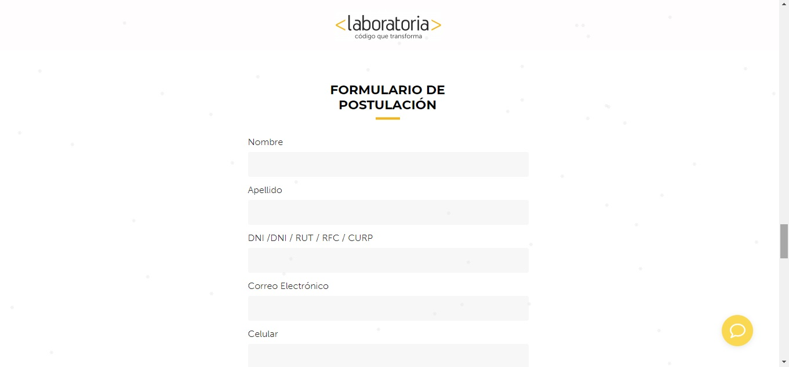

**Elementos UI**

En este formulario podemos observar:

* Diferentes cuadrs de texto donde se solicitan los datos dela psotulante
* Al final de este existe el botón de enviar para que se envpie esa información a la base de datos

**Elementos UX**

En este se puede decir que una postulante puede llegar a sentir la alaegría de haber postulado a Laboratoria

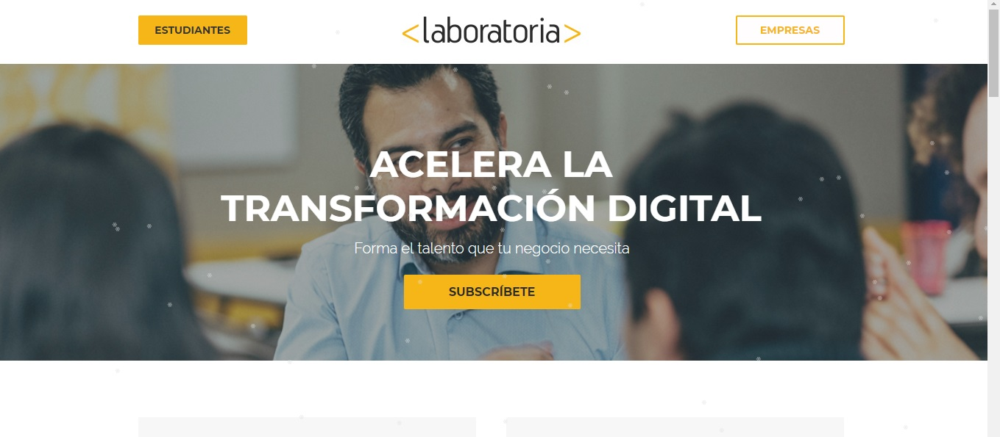

Está pantalla es al dar click en el botón de empresas de la pantalla principal.

**Elementos UI**

* Se ven los dos botones que s even en la pantalla principal
* También se ve un botón de **"Suscribete"**

**Elementos UX**

* Se puede ver en el banner donde hay un hombre que a mi punto de vista luce como empresario
* También se ve la frase **"ACELERA LA TRANSFORMACIÓN DIGITAL
Forma el talento que tu negocio necesita"**

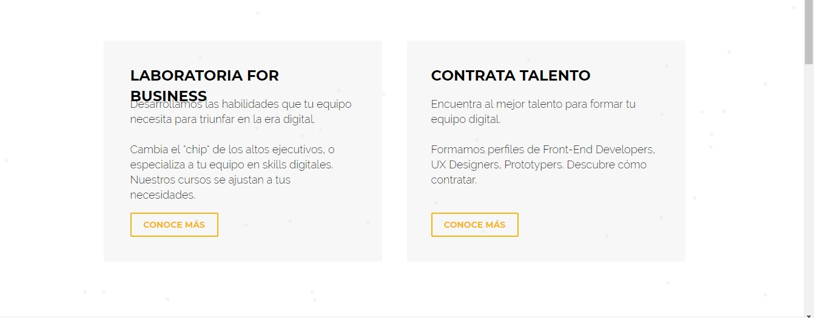

Esta pantalla  es al dar scroll a la pantalla anterior.

**ElementosUI**
* Dos botones de **conoce más** para las dos opciones que se pueden leer ahi

**Elementos UX**
Se pueden leefr dos textos:
* **"Laboratoria for Business"** Donde se pretende ofrecer cursos con material tecnológico a las Empresas
* **"Contrata talento"** DOnde se colocan los perfiles de estudiantes graduadas de Laboratoria

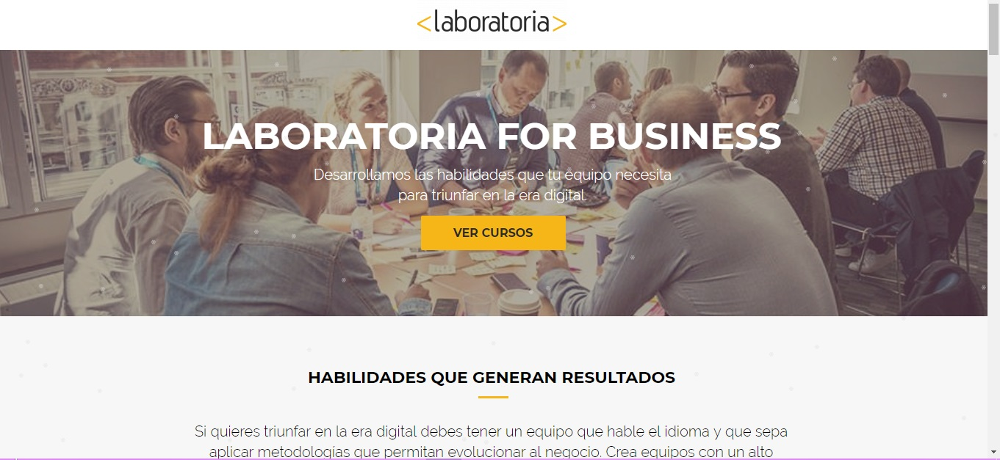

Pantalla que carga al dar click en el botón de Laboratoria for Business

**Elementos UI**

Sólo se observa un botón para que el ususario pued ver los cursos

**Elementos UX**

* Se observa un banner con un equipo de trabajo, lo cua nos puede indicar que se pretende capacitar a grupos de trabaj en el mundo tech.
* Tambien se observa el texto **"LABORATORIA FOR BUSINESS
Desarrollamos las habilidades que tu equipo necesita para triunfar en la era digital."**

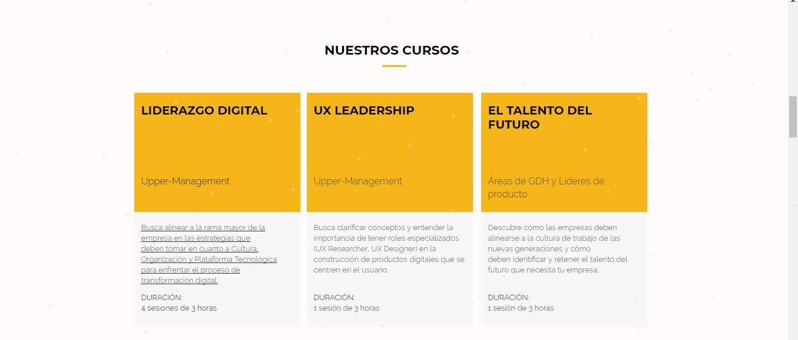

Pantalla de nuestros cursos

**Elementos UI**

En esta pantalla se observa un efecto hover al pasar el puntero por los títulos de los curso y por la descripción, lo cual nos llevara a la descripción detallada de cada uno de ellos.

**Elementos UX**

Esta pantallabusca que las empresas se ibteresen en los diversos cursos animandolos a capacitar a sus trabajadores en tecnología.

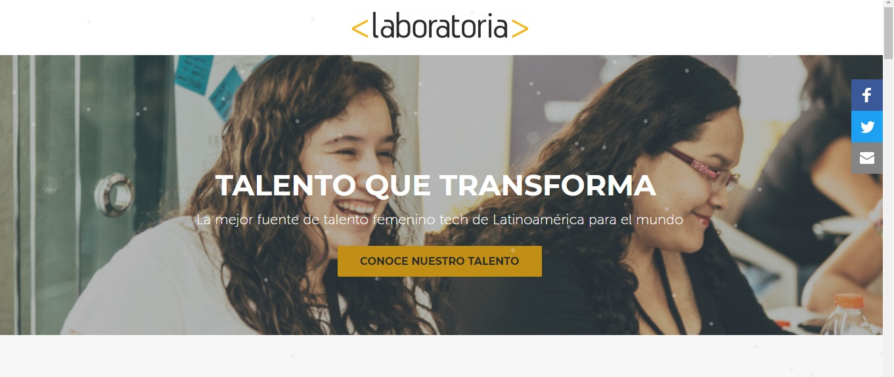

Pantalla al dar click en **"Contrata talento"**

**ELementos UI**

* Botón de **conoce nuestro talento** que nos llevara alos perfiles delas graduadas de Laboratoria.
* Botones de redes sociales de Laboratoria

**ELementos UX**

* Texto que dice **"TALENTO QUE TRANSFORMA
La mejor fuente de talento femenino tech de Latinoamérica para el mundo"**, el cual da pauta a pensar que encontraremos infoacion de las coders.
* Banner con dos mujeres que se puede pensar que son o fueron estudiantes de Laboratoria que buscan trabajo

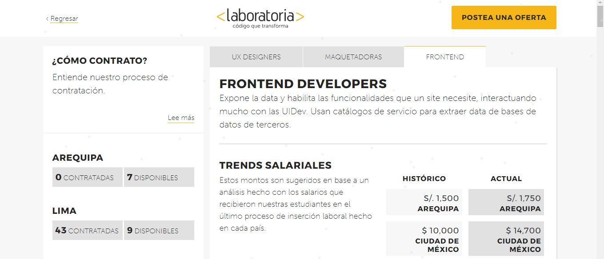

Pantalla con datos para contratar talento LABORATORIA

**Elementos UI**
* Se encuentra un botón en la esquina superior derecha de **Postea una Oferta**
* 3 pestañas donde se muestran lospuestos que ejercen las Postulantes
* Botón de regresar en la parte superior izquierda
* Botón de leer más en el área de ¿cómo contrato?

**Elementos UX**

En esta pantalla ls empresaspyueden ver las coders de la diversas sedes de Laboratoria, tabien da un panorama generk de coo estas pueden contratar nuevo talento

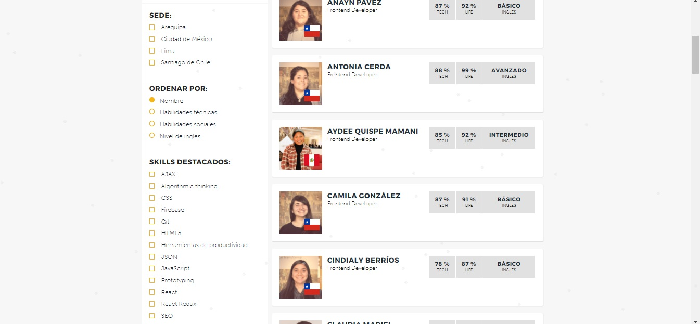

Al dar scroll en esa misma pantalla podemos comenzar a ver todos los perfiles que hay en Laboratoria para contratar

**Elementos UI**
* se observ un filtr donde se pueden seleccionar las sede que se desean veremos
* Filtro para orrdenar la infoación
* Filtro para ver perfiles con ciertas características

**Elementos UX**
Aquí podemos ver como las empresas pueden ver que perfil e adapta a sus necesidades y que es lo que pueden ofrecer mutuamente

## Analisis de Navegación de Github

Este analisis es para describir como ve la página un usuario registrado

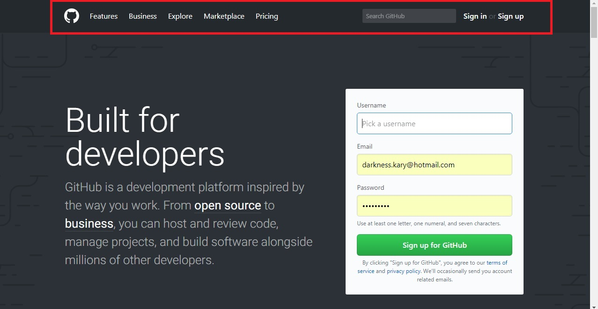

**Pantalla principal**

Esta pantalla tiene encerrado en un recuadro rojo lo que se consideraría la navegación global

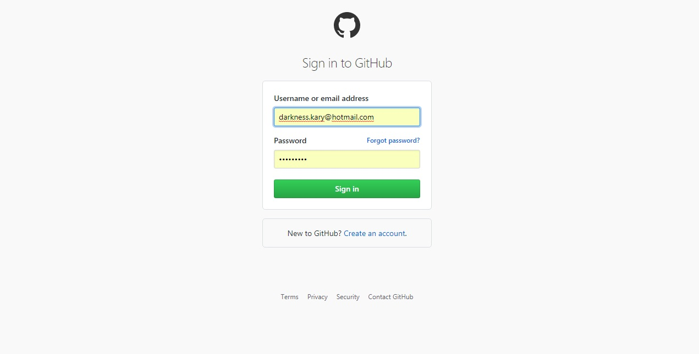

En esta paantalla podemos ver diferentes elementos UI como lo son los cuadros de texto para introducir usuario y comntraseña de ususario registrado y el botón de sig in pra poder entrara a la página.

Una vez que introduzcamos estos datos entonces podremos ver la siguiente pantalla.

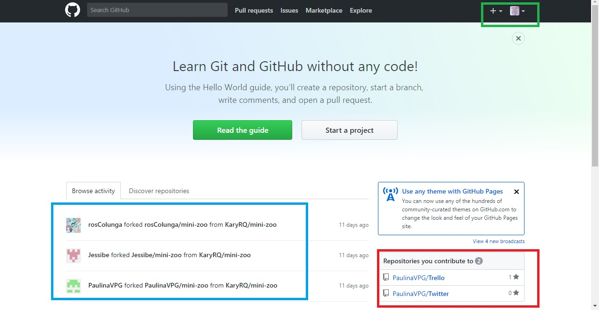

* En esta pantalla podemos observar que en el recuadro verde se encuentra una navegación local

* En el recuadro azul vemos navegación contextual

* En el recuadro rojo es navegación facetada

## SKETCH DE MARVEL

Los datos que se pueden ver son los datos de Lima y primera generación

https://marvelapp.com/project/2534162/
